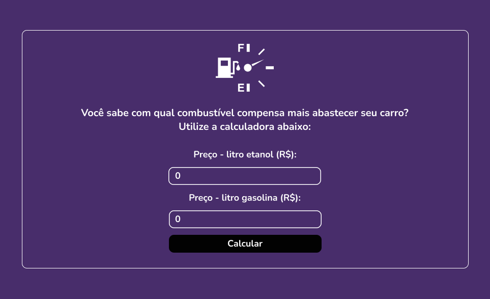

<h2 align='center'>Web II - Atividade - React </h2>

  
  
<a href="https://wemellynunes.github.io/webII-calculadora-react/">Clique aqui</a> para visualizar a pagina

## 📄 Sobre
Uma calculadora para fazer o cálculo entre os combustíveis, a fim de ver qual combustível é o ideal para seu carro, o cáculco é a divisão do preço do litro do
álcool pelo preço do litro da gasolina. Se o resultado desse cálculo for menor que 0.7, utilize álcool. Se for superior a 0.7, então a gasolina é mais vantajosa para abastecer.

## Tecnologias
- React
  
## Colaboradores
Diogo Alvino e Wemelly Nunes

